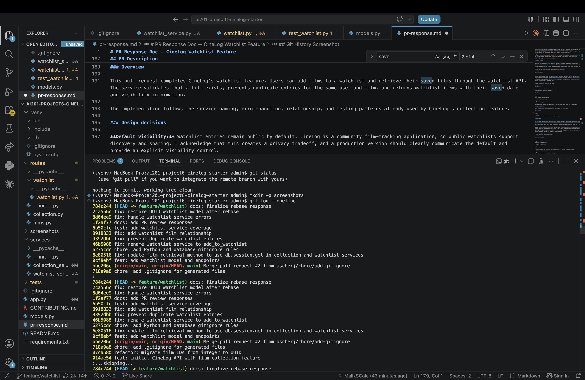

# PR Response Doc — CineLog Watchlist Feature

## AI Usage

I used AI tools to help orient myself in the CineLog codebase and compare the watchlist implementation with the existing collection feature. Specifically, I used AI to explain how `add_to_collection()` handles nonexistent films and duplicate entries, then verified that explanation directly against `services/collection_service.py` before applying the same pattern to the watchlist service.

I also used AI to review my proposed responses for the visibility-default and sort-order design discussions. I treated the feedback as a counterargument check rather than copying a response. My final positions are based on CineLog's community-focused purpose, the behavior already present in the repository, and consistency with the collection feature.

Finally, I used AI to check whether my planned commit messages followed the Conventional Commits format. I verified the recommendations against `CONTRIBUTING.md` before using them.

## Comment 1 — Rename

**What I did:**

I renamed `save_to_watchlist()` to `add_to_watchlist()` in `services/watchlist_service.py`. I also updated the import and function call in `routes/watchlist/watchlist.py`.

This change follows CineLog's existing `verb_to_noun` service naming convention, including functions such as `add_to_collection()`, `remove_from_collection()`, and `get_collection()`.

**How I verified:**

I ran a project-wide search for the old function name:

```bash
grep -R "save_to_watchlist" .
```

After updating the service and route, the search returned no remaining references. I also ran the watchlist tests and the full test suite to verify that the renamed function was imported and called correctly.

## Comment 2 — Deduplication

**What I did:**

I added duplicate-entry handling to `add_to_watchlist()`. Before creating a new `WatchlistEntry`, the service now queries for an existing entry with the same `user_id` and `film_id`.

If an entry already exists, the service raises `AlreadyInWatchlistError` instead of creating another record. I followed the same pattern used by `add_to_collection()`, which performs an explicit query and raises `AlreadyInCollectionError`.

I also added handling for `AlreadyInWatchlistError` in the watchlist route so the API returns HTTP `409 Conflict` for duplicate requests. The route also catches `FilmNotFoundError` and returns HTTP `404` rather than allowing the exception to become an internal server error.

**How I verified:**

I added a test that calls `add_to_watchlist()` twice with the same user and film. The test verifies that the second call raises `AlreadyInWatchlistError` and confirms that only one matching database entry exists.

I ran:

```bash
pytest tests/test_watchlist.py -v
pytest tests/ -v
```

Both test commands passed after the changes.

## Comment 3 — Missing Test

**What I did:**

I created `tests/test_watchlist.py` and added the requested test for a nonexistent film ID. The test follows the same fixture and assertion structure as `test_add_to_collection_nonexistent_film_raises()` in `tests/test_collection.py`.

The test uses a UUID that is not present in the database and verifies that `add_to_watchlist()` raises `FilmNotFoundError`.

I also added coverage for:

- Successfully adding a valid film
- Rejecting a duplicate watchlist entry
- Returning watchlist films newest first

While testing `get_watchlist()`, the test exposed that `WatchlistEntry` did not have access to `entry.film`. I fixed this by adding the missing watchlist relationship to the `Film` model, following the same relationship pattern already used by `CollectionEntry`.

**How I verified:**

I ran:

```bash
pytest tests/test_watchlist.py -v
pytest tests/ -v
```

All watchlist tests and the complete test suite passed.

## Comment 4 — Default Visibility

**My position:**

I kept `public=True` as the default for watchlist entries.

**Reasoning:**

CineLog is described as a community film-tracking application. A public watchlist supports that purpose by allowing users to share what they plan to watch and helping other users discover films through community activity.

Keeping the current default also preserves the behavior already established by the feature instead of silently changing the meaning of existing watchlist entries. For a community-oriented product, public-by-default is a reasonable initial choice as long as the application clearly communicates that behavior to users.

A stronger future implementation would allow the caller to choose visibility explicitly when adding a film and would expose that setting clearly in the user interface.

**Tradeoff acknowledged:**

The main disadvantage is privacy. Some users may assume that saving a film is private unless the product clearly states otherwise. A private-by-default design would reduce the risk of unintentionally exposing user activity.

I am keeping the public default because it better supports CineLog's community focus, but I would pair it with clear UI messaging and an easy visibility control before treating this as a complete production privacy design.

## Comment 5 — Sort Order

**My position:**

I changed the watchlist to sort by `date_added` in descending order, with the most recently added film appearing first.

**Reasoning:**

A watchlist is primarily a record of films a user recently decided they want to watch. Users are therefore likely to return to the list looking for something they just added. Newest-first ordering makes those recent decisions immediately visible.

This also makes the watchlist consistent with `get_collection()`, which already sorts collection entries by `date_added` descending. Using the same ordering rule across both features makes the application easier to understand and maintain.

**Engagement with reviewer's point:**

Alphabetical ordering is predictable and can make a long list easier to scan when the user already knows a title. However, it removes the context of when a film was added and makes newly added films difficult to locate without searching through the full list.

For the default endpoint behavior, I believe recency is more useful than title order. If CineLog later supports query parameters or user-controlled sorting, alphabetical order would be a useful optional mode.

## Comment 6 — Rebase

**What conflicted:**

The rebase onto the updated `main` branch introduced a conflict because the main branch migrated film IDs from integers to UUID strings, while the watchlist branch was created before that refactor.

The watchlist implementation still referenced integer film IDs in the `WatchlistEntry` model and in related documentation.

**How I resolved it:**

> Complete this section immediately after performing the rebase.

I rebased the feature branch using:

```bash
git fetch origin
git rebase origin/main
```

During conflict resolution, I kept the UUID-based `Film` model from the updated main branch and updated `WatchlistEntry.film_id` to use a UUID-compatible string column:

```python
film_id = db.Column(
    db.String(36),
    db.ForeignKey("film.id"),
    nullable=False,
)
```

I also updated remaining watchlist docstrings and endpoint documentation so they describe `film_id` as a UUID rather than an integer.

After resolving the files, I staged them and continued the rebase:

```bash
git add models.py services/watchlist_service.py routes/watchlist/watchlist.py
git rebase --continue
```

**How I verified no conflict remains:**

> Update this section with your actual command output after the rebase.

I ran the complete test suite:

```bash
pytest tests/ -v
```

I confirmed that the working tree was clean:

```bash
git status
```

I confirmed that the branch contains no merge commits:

```bash
git log --merges origin/main..HEAD
```

The command returned no commits. I also reviewed the branch history with:

```bash
git log --oneline --graph origin/main..HEAD
```

## Git History Screenshot

Add the screenshot of the final command below after completing the interactive rebase:

```bash
git log --oneline
```

Recommended repository path:

```text
screenshots/git-log.png
```

Markdown:

```markdown

```

## PR Description

### Overview

This pull request completes CineLog's watchlist feature. Users can add films to a watchlist and retrieve their saved films through the watchlist API. The service validates that a film exists, prevents duplicate entries for the same user and film, and returns watchlist items with their saved date and visibility information.

The implementation follows the service naming, error-handling, relationship, and testing patterns already used by CineLog's collection feature.

### Design decisions

**Default visibility:** Watchlist entries remain public by default. CineLog is a community film-tracking application, so public watchlists support discovery and sharing. I acknowledge that this creates a privacy tradeoff, and a production version should clearly communicate the default and provide an explicit visibility control.

**Sort order:** Watchlist results are returned newest first using `date_added` descending. This prioritizes films the user recently chose to watch and keeps the behavior consistent with the existing collection endpoint.

### Manual testing

1. Create and activate the virtual environment.

```bash
python -m venv .venv
source .venv/bin/activate
```

2. Install the dependencies.

```bash
pip install -r requirements.txt
```

3. Start the Flask application.

```bash
python app.py
```

4. In another terminal, retrieve a valid user UUID and film UUID from the local database or test data.

5. Add a film to the user's watchlist.

```bash
curl -X POST http://127.0.0.1:5000/watchlist/<user_id>/add \
  -H "Content-Type: application/json" \
  -d '{"film_id": "<film_uuid>"}'
```

Expected result: HTTP `201` with the newly created watchlist entry.

6. Send the same request again.

Expected result: HTTP `409` with an error explaining that the film is already in the user's watchlist.

7. Submit a UUID that does not belong to an existing film.

```bash
curl -X POST http://127.0.0.1:5000/watchlist/<user_id>/add \
  -H "Content-Type: application/json" \
  -d '{"film_id": "00000000-0000-0000-0000-000000000000"}'
```

Expected result: HTTP `404` with a film-not-found error.

8. Retrieve the user's watchlist.

```bash
curl http://127.0.0.1:5000/watchlist/<user_id>
```

Expected result: HTTP `200` with watchlist films ordered by `date_added` from newest to oldest.

9. Run the automated tests.

```bash
pytest tests/test_watchlist.py -v
pytest tests/ -v
```
